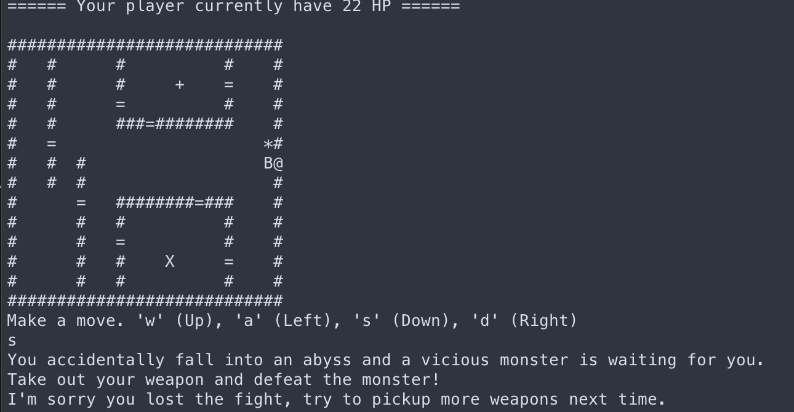
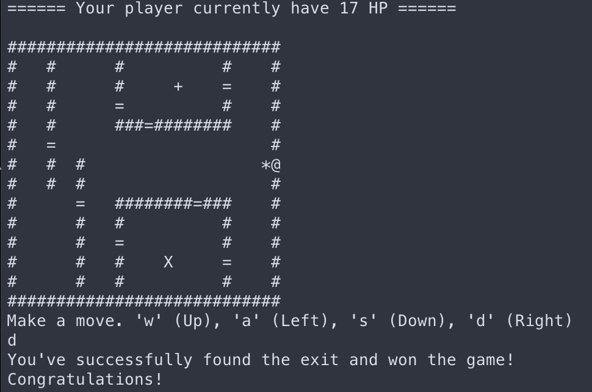

# Fantasy Game

Welcome to the fantasy game! 

You goal as a player is to kill the monster and find the exit (with a sign @). 

* You lose HP with every move so make smart moves and avoid the walls (sign #). 
* There's a fountain (sign +) where you can restore health points, as well as an arsenal where you can pick up weapons. 
* You're free to make any moves however without any weapons it's very unlikely you'll kill the monster
barehanded. 

Enjoy the game!

# How to run
* checkout this project
* run `cd src/`
* run `make`
* run `./fantasygame` and follow instructions

# Clean up
* run `make clean`

# Screenshot

## Defeated by the boss

## Won the game by killing the boss

